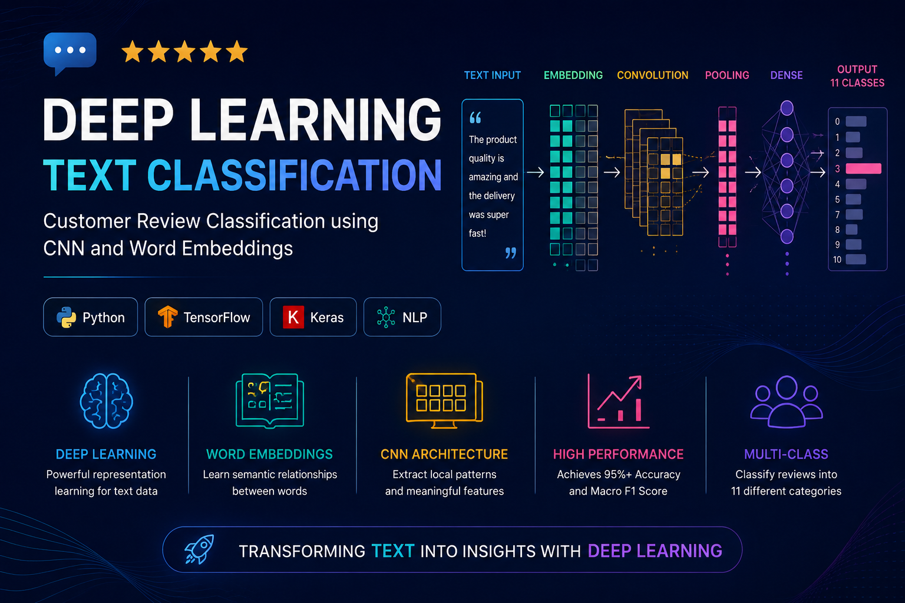
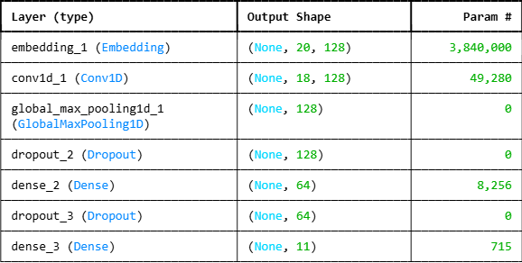
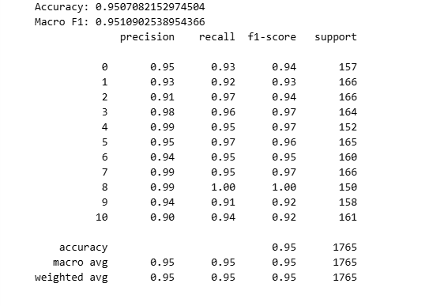

# 📝 Customer Review Classification using Deep Learning

<p align="center">
  
</p>

<div align="center">

# Deep Learning for Natural Language Processing

### CNN • Word Embeddings • Text Classification • TensorFlow


</div>

---

# 🌟 Project Highlights

✅ Natural Language Processing

✅ Deep Learning Text Classification

✅ Word Embeddings

✅ Convolutional Neural Networks (CNN)

✅ Multi-Class Classification

✅ TensorFlow / Keras

✅ End-to-End NLP Pipeline

---

# 📖 Overview

Text classification is one of the most important applications of Natural Language Processing.

In this project, a Deep Learning model was developed to automatically classify customer reviews into multiple categories using trainable word embeddings and convolutional neural networks.

The model learns semantic relationships between words and extracts meaningful textual patterns to perform accurate classification.

---

# 🎯 Problem Statement

Given:

```text
Customer Review Text
```

Predict:

```text
Review Category
```

This task is formulated as a Multi-Class Text Classification problem.

---

# 🔧 Data Preprocessing

Several preprocessing steps were applied before training:

- Text Cleaning
- Tokenization
- Vocabulary Construction
- Sequence Padding
- Numerical Encoding
- Dataset Splitting

---

# 🧠 Model Architecture

The model combines trainable word embeddings with convolutional neural networks.

### Architecture Flow

```text
Input Text
     │
     ▼
Embedding Layer
     │
     ▼
Conv1D
     │
     ▼
Global Max Pooling
     │
     ▼
Dropout
     │
     ▼
Dense Layer
     │
     ▼
Dropout
     │
     ▼
Output Layer (11 Classes)
```

---

## Architecture Visualization

<p align="center">
  
</p>

### Layer Details

| Layer | Output |
|---------|---------|
| Embedding | (None,20,128) |
| Conv1D | (None,18,128) |
| GlobalMaxPooling1D | (None,128) |
| Dense | (None,64) |
| Output | (None,11) |

---

# 📈 Model Performance

The model achieved excellent classification performance across all categories.

<p align="center">
  
</p>

### Results

| Metric | Score |
|----------|--------|
| Accuracy | 95.07% |
| Macro F1 Score | 95.11% |

---

### Classification Report Summary

- Precision: ~95%
- Recall: ~95%
- F1 Score: ~95%

The model demonstrates strong generalization performance and balanced predictions across all classes.

---

# 💡 Why CNN for Text Classification?

CNNs are highly effective for:

- Detecting local word patterns
- Extracting semantic features
- Learning contextual information
- Efficient training on large text datasets

Compared to traditional machine learning approaches, CNNs automatically learn discriminative features from raw text.

---

# 🛠 Technologies Used

| Category | Technologies |
|-----------|-------------|
| Programming Language | Python |
| Deep Learning | TensorFlow, Keras |
| NLP | Tokenization, Embeddings |
| Machine Learning | Scikit-Learn |
| Visualization | Matplotlib |
| Environment | Jupyter Notebook |

---

# 📂 Project Structure

```text
customer-review-classification/
│
├── data/
│
├── images/
│   ├── project_banner.png
│   ├── model_architecture.png
│   └── model_results.png
│
├── notebooks/
│   └── text_classification.ipynb
│
├── README.md
├── requirements.txt
├── LICENSE
└── .gitignore
```

---

# 🚀 Installation

```bash
git clone https://github.com/moeinalva/customer-review-classification.git
```

```bash
pip install -r requirements.txt
```

```bash
jupyter notebook
```

---

# 🔮 Future Improvements

- LSTM Comparison
- GRU Comparison
- Transformer Models
- BERT Fine-Tuning
- Attention Mechanisms
- Hyperparameter Optimization
- Model Deployment with FastAPI

---

# 👨‍💻 Author

## Moein Alva

Machine Learning & Deep Learning Enthusiast

Areas of Interest:

- Deep Learning
- Natural Language Processing
- Recommendation Systems
- Computer Vision
- Data Science

GitHub:

https://github.com/moeinalva

---

# 📄 License

This project is licensed under the MIT License.

---

<div align="center">

⭐ If you found this project useful, consider giving it a star.

🚀 Built with TensorFlow, Keras and Natural Language Processing

</div>
